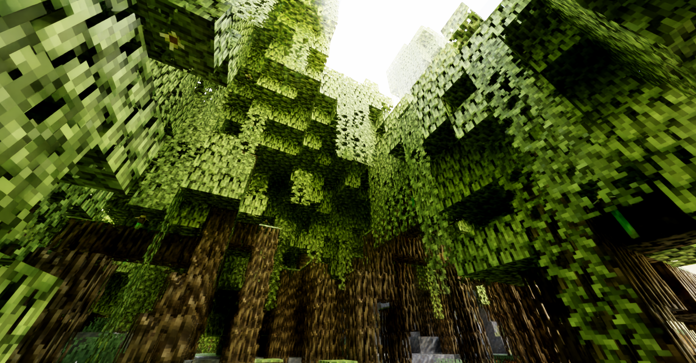

# Caustica

Caustica is an experimental ray-traced renderer for Minecraft 26.2's Vulkan backend.
It replaces the vanilla world view with hardware ray tracing and NVIDIA DLSS
features while keeping Minecraft's familiar UI and gameplay intact.

Caustica is early software. Expect bugs, missing visual cases, and frequent
changes while the renderer is being built.

## About This Fork

This repository is an architectural rewrite fork of [Caustica](https://github.com/xysgottaken2/Caustica) (originally created by ComfyFluffy and contributors, licensed under `LGPL-3.0-or-later`).

The primary focus of this rewrite fork is to introduce a robust, modular rendering architecture for Minecraft 26.2's Vulkan backend:
- **Modular Resource & Pass Architecture**: Decoupled ownership across `FramePipeline`, `RenderGraph`, `PostProcessing`, `WorldTraceResources`, and `TraceFrameResources`.
- **Reliable Lifecycle & Teardown**: Strict device quiescence on level transitions and client teardown to prevent GPU crashes and resource leaks.
- **Enhanced Ray-Tracing Pipeline**: Full Vulkan hardware path tracing, ReSTIR spatio-temporal resampling, SHaRC spatial hash radiance cache, native SVGF denoising, and DLSS Ray Reconstruction.
- **Color & Presentation**: Native HDR10/PQ presentation on supported platforms alongside standard SDR.

See the upstream project at <https://github.com/xysgottaken2/Caustica> and project license files for original authorship and licensing details.

## Links

- [Upstream Repository](https://github.com/xysgottaken2/Caustica)
- [Discord](https://discord.gg/SeWCjyKu2)
- [Modrinth](https://modrinth.com/mod/caustica)
- [CurseForge](https://www.curseforge.com/minecraft/mc-mods/caustica/preview)
- [Gallery](docs/gallery.md)

## Features

- Vulkan hardware path-traced world rendering
- DLSS Ray Reconstruction support
- Native SVGF denoiser
- ReSTIR spatio-temporal resampling and SHaRC radiance caching
- DLSS Frame Generation support (experimental)
- HDR output
- Dynamic entity rendering in the ray-traced scene
- LabPBR-style material support, including toggleable subsurface scattering

## Requirements

- **Vulkan graphics backend enabled**
- A GPU and driver with Vulkan ray tracing support
- NVIDIA RTX GPU and supported driver for DLSS features
- HDR-capable display and OS HDR mode for HDR output
- On Linux, an HDR-capable Wayland compositor and a native Wayland session for HDR output
- Install LabPBR resource pack like [SPBR](https://modrinth.com/resourcepack/spbr) for better visuals

## Installation

1. Install Fabric Loader for Minecraft `26.2`.
2. Install Fabric API.
3. Put the Caustica jar in your Minecraft `mods` folder.
4. Launch the game with the Vulkan graphics backend.
5. Open Video Settings to adjust Caustica's renderer options.

## Usage Notes

- Caustica is client-side only.
- DLSS Ray Reconstruction and Frame Generation require supported NVIDIA
  hardware and drivers.
- On Linux if Minecraft crashes on startup with stack overflow errors, try adding `-Xss2M` to the Java args to increase the stack size.
- Use Java args to improve performance. Minecraft Launcher default:
  `-XX:+UseCompactObjectHeaders -XX:+AlwaysPreTouch -XX:+UseStringDeduplication -XX:+UseZGC`
- Frame Generation is experimental and needs to be enabled by modifying the configuration file.
- HDR output requires an HDR swapchain and a correctly configured HDR display.
- When HDR is enabled on Linux, Caustica selects GLFW's native Wayland backend automatically. X11/XWayland surfaces generally do not expose the required HDR10/PQ format.
- If Minecraft falls back to OpenGL after a crash, re-enable the Vulkan backend
  before using Caustica again.

## Compatibility

Caustica takes over the world renderer, so other mods that heavily modify world
rendering, shader pipelines, post-processing, or the Vulkan backend may conflict.
UI-only mods are more likely to work.

## Status & Qualification

Caustica is experimental software under active development. Current work focuses on visual correctness, world coverage, and runtime stability.

### Runtime Target & Qualification Scope
- **Qualified Core Pipeline**: Vulkan hardware ray tracing, DLSS Ray Reconstruction, native SVGF denoising, ReSTIR spatio-temporal resampling, SHaRC radiance cache, LabPBR 1.3 materials, and SDR/HDR presentation are qualified.
- **Compatibility & Upscaling Waivers**: Integration code for Distant Horizons (DH), Voxy, AMD FSR 3, and Intel XeSS is present in the repository, but runtime qualification is covered under authorized waivers.
- **Denoiser Scope**: NVIDIA Real-Time Denoisers (NRD) is experimental, quarantined, and **out of target / not required** for production. The production baseline uses NVIDIA DLSS-RR and the native SVGF denoiser.

## License

Caustica's project-owned source code and documentation are licensed under the
GNU Lesser General Public License v3.0 or later. See [LICENSE.md](LICENSE.md),
[COPYING](COPYING), and [COPYING.LESSER](COPYING.LESSER).

Release artifacts may bundle NVIDIA DLSS/NGX SDK components under NVIDIA's own
license terms. See [THIRD_PARTY_NOTICES.md](THIRD_PARTY_NOTICES.md).

## TODO List

- [x] Nether/End sky, weather, volumetric fog/clouds
- [x] Spatio-temporal ReSTIR & SHaRC radiance cache
- [x] Modular architecture rewrite & device quiescence lifecycle
- [x] Native SVGF denoiser pipeline
- [ ] Non-NVIDIA upscaler qualification (FSR 3 / XeSS waivers)
- [ ] Distant Horizons & Voxy compatibility qualification (waivers)
